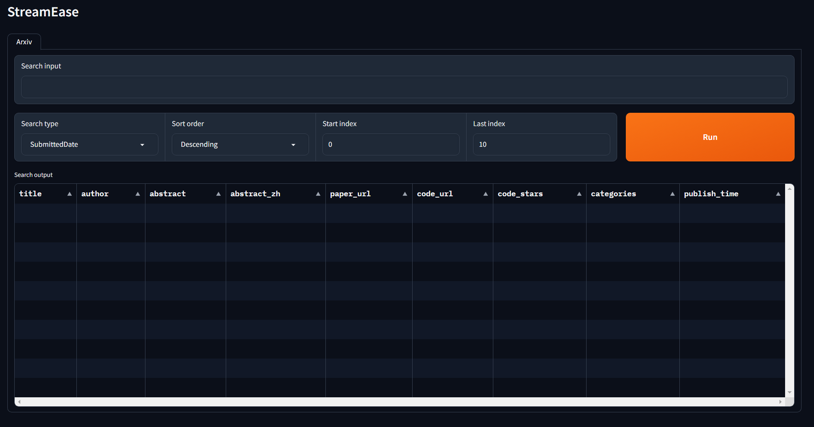
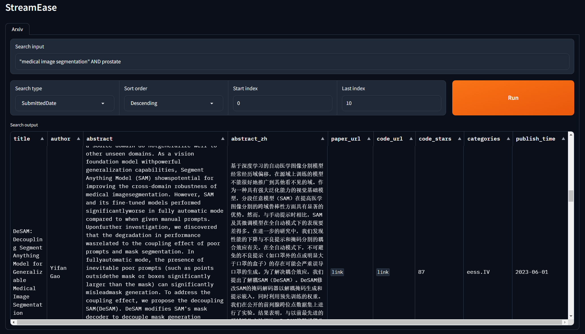

# StreamEase

StreamEase 工具箱是一款提升工作效率的软件，目前支持 Arxiv 论文检索。





## 功能

- ArXiv 论文检索

    - 提取论文标题、作者、摘要、摘要中文翻译、论文链接、代码链接、GitHub 仓库star数、论文分类、论文发表时间
    
    - [支持高级检索](https://info.arxiv.org/help/api/user-manual.html)

## Quick Start

### API

- 百度翻译 API 获取

    注册 [百度翻译开放平台](https://api.fanyi.baidu.com/) 账号，申请通用文本翻译 API（高级版），每月有100万字符免费翻译
    
    替换 [config.py](./config.py) 中的 `BAIDU_APP_ID` 和 `BAIDU_APP_KEY`
    
    ```python
    BAIDU_APP_ID = ""
    BAIDU_APP_KEY = ""
    ```

### Installation

```bash
pip install -r requirements.txt
```

### Usage

```bash
python app.py
```

## 使用方法

### Arxiv 论文检索

- 检索语法：(英文检索)

    - 单个关键词：[关键词]

        ```
        segmentation
        ```

    - 多个关键词：[关键词1] [布尔运算符] [关键词2] [布尔运算符] ...
    
        布尔运算符：`AND` 表示交集 (同时存在A和B)、`OR` 表示并集 (A或者B)、`ANDNOT` 表示差集 (A中不包含B)

        ```
        segmentation AND prostate
        segmentation OR classification
        segmentation ANDNOT U-Net
        ```

    - 语句：["语句"]

        ```
        "medical image segmentation"
        ```

    - 组合检索：[关键词 / "语句"] [布尔运算符] [关键词 / "语句"]

        ```
        "medical image segmentation" AND prostate
        ```

- 搜索排序

    - **Search type** : [`SubmittedDate` / `Relevance` / `LastUpdatedDate`]
        
        分别表示按提交日期、相关度、最后更新日期进行检索排序
    
    - **Sort by** : [`Descending` / `Ascending`]
        
        分别表示降序和升序
    
    - **Start index** & **Last index**

        检索结果的起始和结束索引

- 返回结果

    |tittle|author|abstract|abstract_zh|paper_url|code_url|code_stars|categories|publish_time|
    |------|------|--------|-----------|---------|--------|----------|----------|------------|
    |论文标题|作者|摘要|摘要中文翻译|论文链接|代码链接|GitHub仓库star数|论文分类|论文发表时间|
